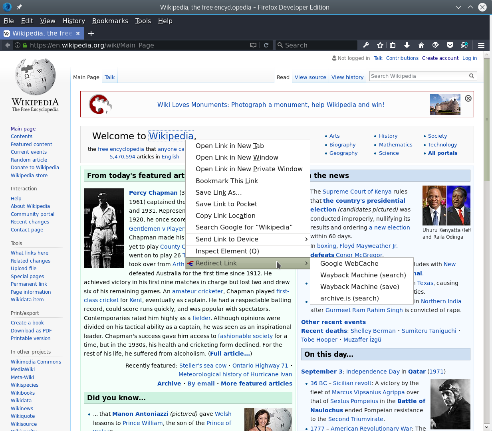

## Description

A WebExtension for redirecting links to somewhere else. If you don't want
to support some site for some reason, you can view the page's content in
Google's WebCache. Or if the site is small and doesn't have a lot of resources
and it could go down, when a lot of people visit the site, you can easily open
the link in Internet Archive's Wayback Machine.

## Options

The URL input in the options defines where the link is redirected to. It can
contain formats, which are replaced by the component parts of the clicked link.

If the URL doesn't contain any formats, the link's URL is appended to this URL.

If URL contains a literal format, which should not be replaced, write %25 and
the format letter.

Example:

    http://example.com/?param=%u - http://example.com/?param=%25u

Formats:

    %u - entire URL
    %s - scheme
    %h - hostname
    %p - path
    %q - query parameters
    %f - fragment

## Screenshots

## License

Everything else is licensed as GPL3, but the images are licensed as
GFDL 1.2/CC-by-sa-2.5/CC-by-sa-3.0. The author of the original
image is Stephan Baum. The image was found on [Wikimedia Commons](https://commons.wikimedia.org/wiki/File:Disambiguation.svg).
