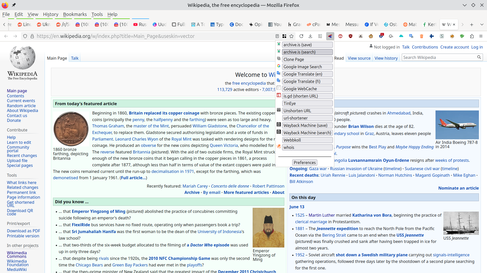
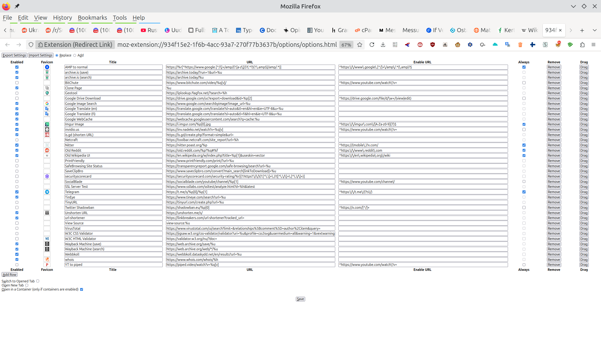

## Description

A browser extension for redirecting links to somewhere else. If you don't want
to support some site for some reason, you can view the page's content in
Google's WebCache. Or if the site is small and doesn't have a lot of resources
and it could go down, when a lot of people visit the site, you can easily open
the link in Internet Archive's Wayback Machine. archive.is is also provided
from start and you can add more.

## Install

[Firefox Add-ons](https://addons.mozilla.org/en-US/firefox/addon/redirect-link/)

[Chrome Web Store](https://chrome.google.com/webstore/detail/redirect-link/jlmiipndkcgobnpmcdhinopedkkejkek)

## Usage

You can redirect links and the current page. Current page can be redirected by
clicking the right mouse button on the page, not on any kind of media or other
elements, but basically the background.

Left click redirects in the current tab and middle click opens a tab and
redirects it. This doesn't work in the context menu in Chrome. And in Firefox
for Android, a touch redirects the current tab and a long touch redirects in a
new tab.

Watch a [demo](https://fluks.github.io/redirect-link/) video what this
add-on does.

## Options

The URL field denotes where the page or the link is redirected to. It must start
with a scheme, e.g. https://. It can contain formats, which are replaced by the
component parts of the link's or page's URL. If the URL doesn't contain any
formats, the link's or page's URL is appended to this URL.

You can reorder redirections by dragging and dropping rows.

### Formats

* %u - entire URL -- https://fsf.org, %u = https://fsf.org
* %s - scheme -- https://fsf.org, %s = https
* %h - hostname -- https://fsf.org, %h = fsf.org
* %p - whole path without the leading slash, or %p[N], where N is index of the
path part -- https://fsf.org/a/b/c/, %p = a/b/c/, %p[0] = a, %p[1] = b, %p[2]
  = c
* %q - all query parameters, or %q[KEY], where KEY is the name of the query
parameter -- https://fsf.org/a/b/c?x=1&y=2, %q = x=1&y=2, %q[x] = 1, %q[y] = 2
* %f - fragment -- https://fsf.org/a/b/c?x=1&y=2#foobar, %f = foobar
* %r[REGEX] - the regular expression is replaced with the match, or if capture groups are used, their matches are concatenated or empty string if there's no match. Right square brackets must be escaped in the regex. E.g. https://%r[[a-z.\\]+]. (?:) grouping isn't included in the replacement as expected -- https://www.fsf.org/blogs/, %r[//(.\*?)/(.\*)] = www.fsf.orgblogs
* %g[N] - Capturing group from EnableURL field, where N is the index of captured group -- https://fsf.org/a/b/c?x=1&y=2#foobar. Enable URL: ://([^/]\*)/.\*#(.*), %g[0] = ://fsf.org/a/b/c?x=1&y=2#foobar (the whole match of Enable URL), %g[1] = fsf.org, %g[2] = foobar
* %e[/REGEX/REPLACEMENT/FLAGS] - Replace REGEX with REPLACEMENT and optionally use FLAGS (i, g, etc.) using link/page URL as input. If you put some format before this format, it is used as input for this format. Example: http://a.com/%p[1]%e[/a|b|c/x/g] - %p[1] is used for input for %e and it changes all occurances of a, b and c to x from %p[1]

There are examples in the other screenshot.

To enable a redirection everywhere, leave Enable URL field empty. If you want to
enable it only on certain URLs, add the URL or part of it and you can use a
regular expression also.

If you want to redirect always you can check Always field after you have set the
Enable URL. Then if Enable URL matches the page is redirected automatically.

Remember to save if you changed options!

More redirections and you can propose or share new redirections at GitHub in
this issue: https://github.com/fluks/redirect-link/issues/7

All proposed redirections in [this file](https://github.com/fluks/redirect-link/raw/master/redirect-link_settings.json)
you can import.

## Permissions

* Access your data for all websites - Needed for disabling redirections on
  certain URLs.
* Access browser tabs - Get the URL of the current page.

## Screenshots





## Developing

### Requirements

* make, npm, Firefox

### Environment

* ```make install_dependencies```
* Make sure correct manifest is in root directory: ```make change_to_firefox```
* Change ```firefox-bin``` variable in [Makefile](./Makefile) to point to your Firefox binary you want to use and ```ff-profile``` variable to your Firefox profile you want to use.
* ```make run```
* ```make test```

## License

Everything else is licensed as GPL3, but the images are licensed as
GFDL 1.2/CC-by-sa-2.5/CC-by-sa-3.0. The author of the original
image is Stephan Baum. The image was found on
[Wikimedia Commons](https://commons.wikimedia.org/wiki/File:Disambiguation.svg).
